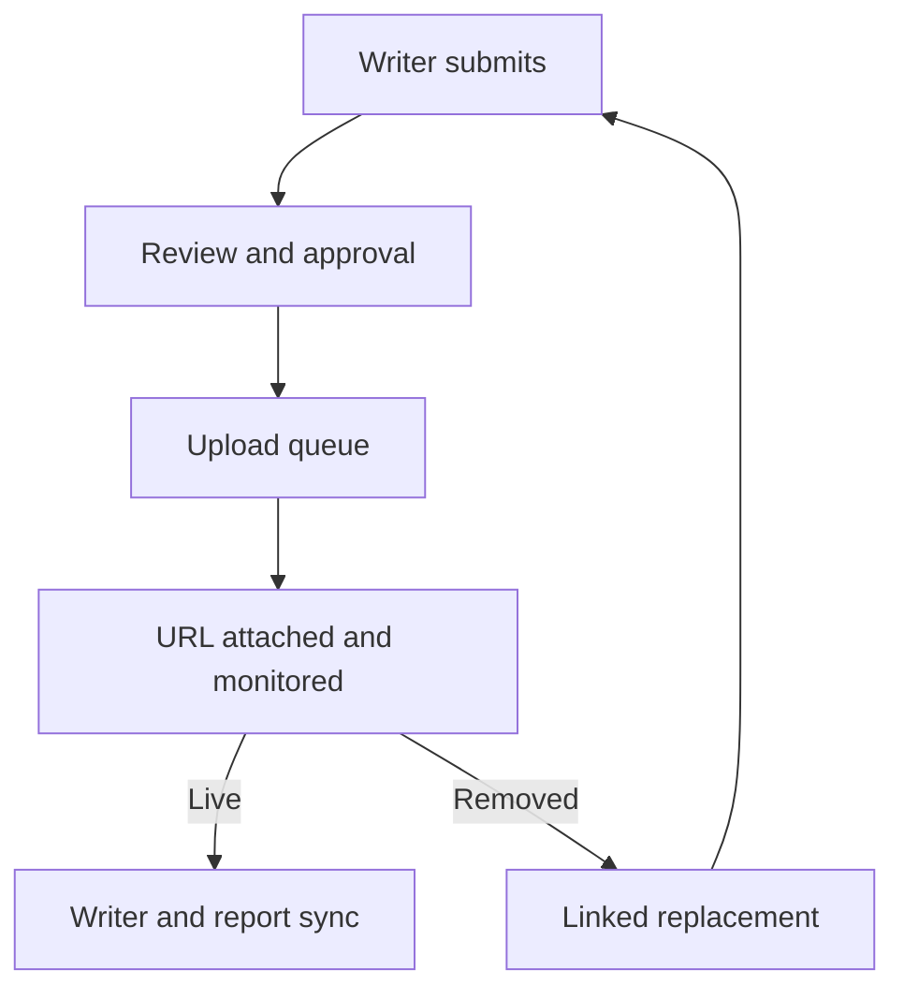

# Architecture

## System boundary

Oddmodish OS is a multi-role agency operations application. The first production slice must prove one shared, auditable content lifecycle before expanding dashboards.

## Recommended runtime

- Next.js App Router and TypeScript
- PostgreSQL through Supabase, including Auth, Row Level Security, Realtime and Storage
- Domain services between UI, automations, agents and the database
- Event-driven automation with an idempotent action queue and audit log
- Netlify for previews, production deploys and scheduled monitoring jobs

## Core entities

Organization, membership, client, CRM opportunity, campaign, task, content item, Reddit account, monitor event, replacement record, time entry, report, reminder, automation rule, notification, activity event and AI action.

## Permission model

Use RBAC plus resource scope. Roles are defaults, not hard-coded authorization. Every mutation is authorized server-side and every AI/automation action records requester, source, before, after and timestamp.

## Integration rule

External services never write directly to UI state. They call domain services, which persist the change and emit a domain event. Consumers update queues, dashboards, reports, reminders and notifications from that event.

## Reddit monitoring constraints

The monitor receives attached URLs, checks permitted public/API signals on a conservative schedule, records evidence, and emits state changes. A removed or unavailable URL requires classification because deletion, subreddit moderation, account suspension and transient errors need different recovery paths. Never automate behavior intended to evade platform enforcement.
